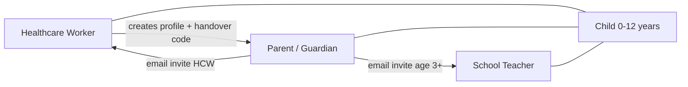
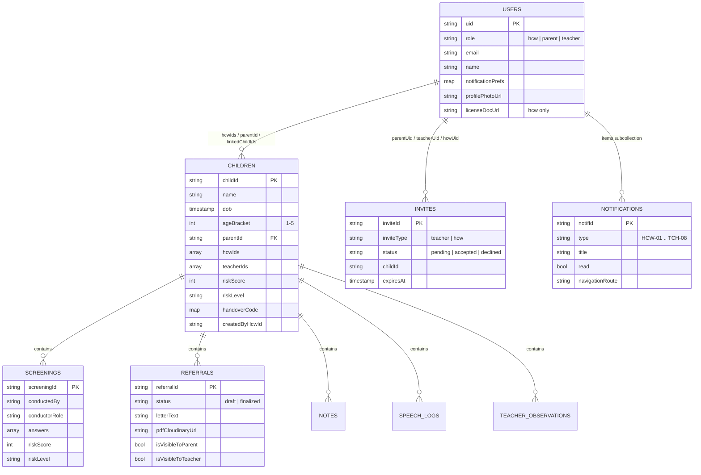
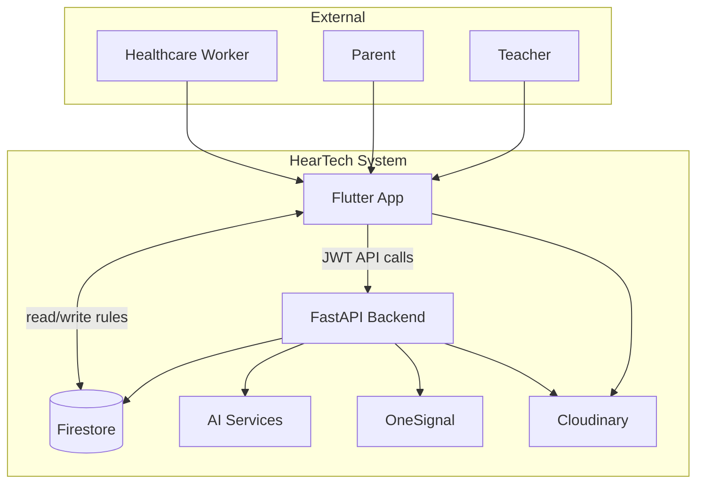
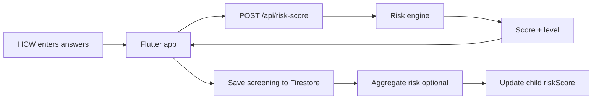
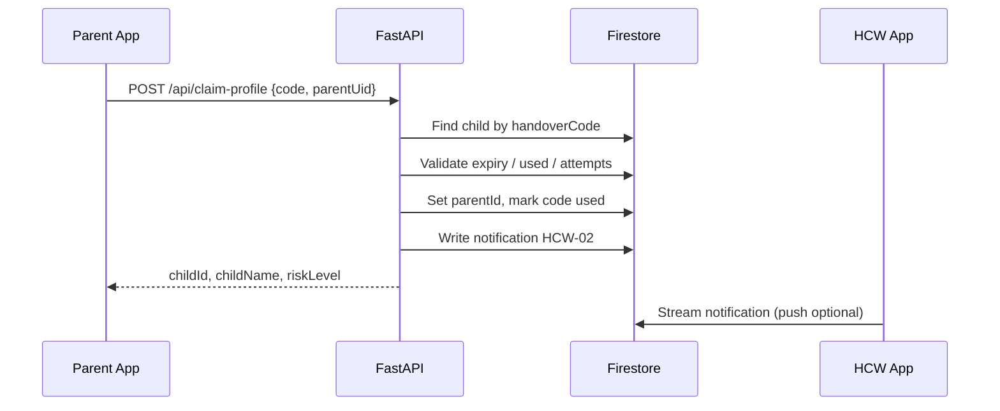
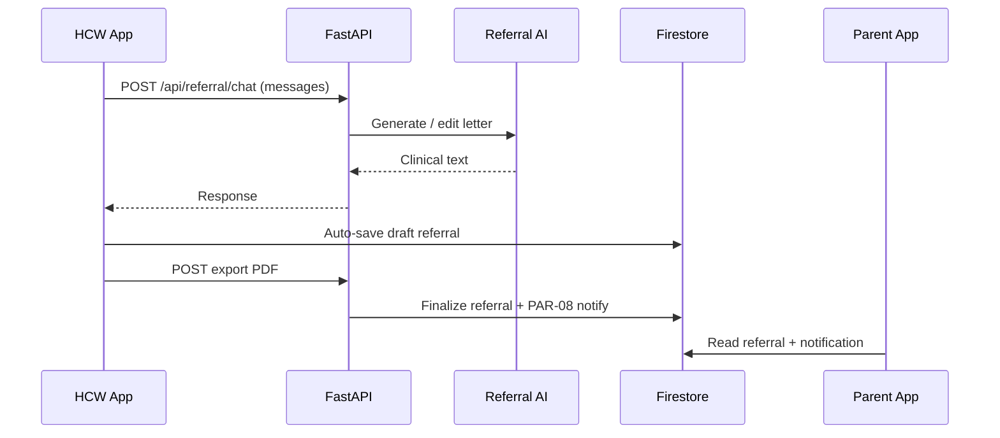
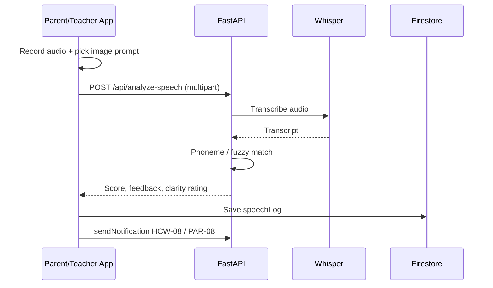
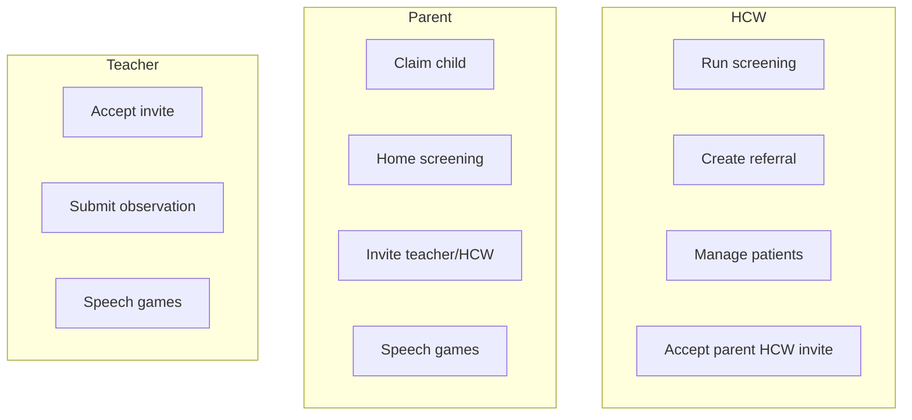

# HearTech — Open House & Exhibition Presentation Guide

**Early Hearing, Better Futures**

| | |
|---|---|
| **Project** | HearTech — Early Childhood Hearing Risk Screening & Coordinated Care |
| **Institution** | University of Central Punjab (UCP) |
| **Program** | Final Year Project (FYP) |
| **Group** | F25CS070 |
| **Supervisor** | Mr. Ihtisham-Ul-Haq |
| **Version** | 1.0.0 |
| **Platform** | Flutter (iOS & Android) |

---

## Table of contents

1. [Elevator pitch](#1-elevator-pitch-30-seconds)
2. [Project motivation](#2-project-motivation)
3. [Problem statement](#3-problem-statement)
4. [Project description](#4-project-description)
5. [Objectives](#5-objectives)
6. [Target users & stakeholders](#6-target-users--stakeholders)
7. [Key features](#7-key-features)
8. [How the system works](#8-how-the-system-works-end-to-end)
9. [System architecture](#9-system-architecture)
10. [Technology stack](#10-technology-stack)
11. [Diagrams](#11-diagrams)
12. [Data model & security](#12-data-model--security)
13. [AI & innovation](#13-ai--innovation-highlights)
14. [Notifications system](#14-notifications-system)
15. [Findings & results](#15-findings--results)
16. [Testing & validation](#16-testing--validation)
17. [Challenges & how we solved them](#17-challenges--how-we-solved-them)
18. [Screenshots](#18-screenshots-for-poster--slides)
19. [Live demo script](#19-live-demo-script-5-7-minutes)
20. [Future plans & enhancements](#20-future-plans--enhancements)
21. [Team & acknowledgements](#21-team--acknowledgements)
22. [Q&A preparation](#22-qa-preparation)
23. [Poster & slide checklist](#23-poster--slide-checklist)

---

## 1. Elevator pitch (30 seconds)

> **HearTech** is a mobile screening and care-coordination platform for children aged **0–12 years**. It helps healthcare workers run structured hearing-risk questionnaires, links parents and teachers to the **same child profile**, and uses **AI** to draft clinical referrals and analyze speech exercises. It is a **decision-support tool**, not a replacement for formal audiology — but it catches risk earlier and keeps everyone on the same page.

---

## 2. Project motivation

### Why we built HearTech

- **Early hearing loss is common but often detected late.** Many children are diagnosed only after speech or school performance suffers.
- **Information is fragmented.** A clinic may screen a child, but parents and teachers rarely see the same structured record. Observations at home and in the classroom rarely reach the clinician in one place.
- **Existing tools are either too clinical or too informal.** Paper forms, WhatsApp messages, and generic health apps do not support **age-specific hearing questionnaires**, **risk scoring**, **secure handover**, and **role-based privacy** in one product.
- **Pakistan and similar contexts** need low-cost, mobile-first solutions that work on mid-range phones and spotty connectivity — not hospital-only desktop software.

### Personal / academic motivation

- Apply **mobile development**, **cloud backend**, and **medical AI** in a real-world paediatric health domain.
- Design for **three distinct user roles** (HCW, parent, teacher) with clear permissions — a strong software-engineering and UX challenge.
- Deliver an **exhibition-ready** product: working app, backend API, AI referral assistant, speech games, and push notifications.

### Impact we aim for

| Stakeholder | Intended impact |
|-------------|-----------------|
| **Healthcare worker** | Faster screening, documented risk, AI-assisted referrals, patient list in one app |
| **Parent** | Understand child’s risk in plain language, home check-ins, speech practice, control over teacher access |
| **Teacher** | Structured classroom observations without seeing sensitive clinical scores |
| **System** | Earlier referral to ENT/audiology when risk is elevated |

---

## 3. Problem statement

| Problem | Detail |
|---------|--------|
| **Late detection** | Hearing issues may go unnoticed until age 3–5+ when speech delays become obvious |
| **Siloed data** | Clinic, home, and school observations are not linked on one secure profile |
| **No shared risk language** | Parents get vague advice; teachers lack guidance on what to watch for |
| **Referral friction** | Writing referral letters is time-consuming; quality varies by clinician |
| **Follow-up gaps** | No automated reminders for re-screening, home checks, or classroom observations |
| **Trust & privacy** | Teachers should not see full clinical scores; parents should control who sees referrals |

**Scope boundary (important for judges):** HearTech does **not** diagnose hearing loss. It **screens** and **coordinates care** — formal diagnosis remains with qualified professionals.

---

## 4. Project description

**HearTech** is a **cross-platform mobile application** (Flutter) backed by a **Python FastAPI** server, **Firebase** (Auth + Firestore), **Cloudinary** (media/PDFs), and **OneSignal** (push alerts).

### What the app does (one paragraph)

Healthcare workers register children through a **multi-step screening flow** (demographics, medical history, age-bracket questionnaire, clinical note, risk result). A **6-character handover code** lets parents **claim** the profile. Parents run **home screenings** and **speech games** (Show and Tell, Ling Six). Parents can **invite teachers** (email, child age 3+) and **invite a new healthcare worker** if the previous one unlinks. Teachers submit **classroom observations**. HCWs use an **AI Clinical Assistant** to ask clinical questions and **generate, edit, and finalize referral letters** (PDF + text). **28 typed notifications** keep all roles informed. **Risk scores** aggregate contributions from HCW, parent, teacher, and speech sessions with role-based weights.

### Product type

| Attribute | Value |
|-----------|--------|
| Category | Health tech / paediatric screening / care coordination |
| Delivery | Native-feel mobile app (iOS & Android) |
| Deployment | Firebase cloud + optional Cloud Run backend |
| AI | On-device/cloud referral model + Whisper speech analysis |

---

## 5. Objectives

### Primary objectives (achieved)

1. **Implement age-appropriate hearing-risk screening** for five brackets (0–6 months through 6–12 years).
2. **Compute and display risk scores** (0–100) with Low / Medium / High bands and milestone breakdown.
3. **Link HCW, parent, and teacher** on a single Firestore child profile with secure handover and email invites.
4. **Provide AI-assisted referral drafting** with guardrails and PDF export.
5. **Offer speech screening mini-games** with automated feedback (Whisper + phoneme analysis).
6. **Enforce role-based access** via Firestore security rules and portal-separated login.
7. **Notify users** via in-app centre + OneSignal push (28 notification types).

### Secondary objectives (achieved)

- Offline-friendly caching (Hive) for poor connectivity
- Profile photo and license document upload (Cloudinary)
- HCW unlink / delete unclaimed profiles; parent re-invite HCW
- Registration resume per role; cross-portal login protection
- Manual test guides for QA and exhibition

---

## 6. Target users & stakeholders



| Role | Registration | Primary goals |
|------|--------------|---------------|
| **Healthcare Worker (HCW)** | License + hospital details | Screen, document, refer, monitor patients |
| **Parent** | Claim via handover code | Monitor child, home screening, speech, invite teacher/HCW |
| **Teacher** | School email | Observe classroom behaviour, speech sessions (limited view) |

---

## 7. Key features

### 7.1 Healthcare Worker (HCW)

| Feature | Description |
|---------|-------------|
| **New screening** | 7-step flow: child info → questionnaire → clinical note → processing → result → handover code → optional Clinical Assistant |
| **Follow-up screening** | Repeat questionnaire for existing patients |
| **Patient list** | Dashboard + dedicated patients screen |
| **Child profile** | Tabs: Overview, Screenings, Referrals, Observations, Notes, Speech |
| **Clinical Assistant** | Chat UI: clinical Q&A + referral letter generation/editing |
| **Referrals** | Draft → review → finalize → PDF on Cloudinary → parent notified |
| **Handover code** | 6-character code, 24h expiry, rate-limited attempts |
| **Unlink / delete** | Unlink from parent-linked profile; delete unclaimed profile |
| **Pending invites** | Accept parent invitations to join a child profile |

### 7.2 Parent

| Feature | Description |
|---------|-------------|
| **Claim profile** | Enter HCW handover code |
| **Home screening** | Same engine as HCW; plain-language results (no raw clinical jargon) |
| **Children hub** | List linked children |
| **Child profile** | Screenings, referrals, notes (public), observations, speech |
| **Speech games** | Show and Tell + Ling Six |
| **Invite teacher** | Email invite (child must be 3+) |
| **Invite healthcare worker** | Email invite when no HCW linked |
| **Referral sharing** | Toggle visibility of finalized referrals to teacher |
| **Remove HCW / teacher** | Manage linked professionals |

### 7.3 Teacher

| Feature | Description |
|---------|-------------|
| **Pending invites** | Accept/decline parent invitations |
| **My Class** | Linked children |
| **Observations** | Frequency-based questionnaire + optional note |
| **Limited profile** | Risk **label** only (Low/Medium/High) — **no numeric score** |
| **Speech games** | Run sessions for linked children |
| **Shared referrals** | Read-only if parent enabled sharing |
| **Unlink** | Remove self from student profile |

### 7.4 Cross-cutting features

| Feature | Description |
|---------|-------------|
| **Authentication** | Email/password + Google Sign-In; role-specific login portals |
| **Notifications** | 28 types; in-app inbox; OneSignal push; per-type preferences |
| **Offline cache** | Hive for screenings/notifications when offline |
| **About & disclaimer** | In-app legal/ethical disclaimer |
| **Analytics** | Firebase Analytics hooks via router observer |

---

## 8. How the system works (end-to-end)

### Step 1 — Screen (HCW)

1. HCW logs in → **New Screening**
2. Enters child name, DOB, gender, medical history (premature birth, NICU, family history, ear infections)
3. App selects **age bracket** automatically from DOB
4. HCW answers bracket-specific questionnaire (YES / PARTIAL / NO / NOT SURE)
5. Backend calculates **session risk score** → Low / Medium / High
6. HCW adds optional clinical note → creates Firestore child + first screening
7. **Handover code** displayed for parent (e.g. `ZUMALX`)

### Step 2 — Link (Parent)

1. Parent registers → **Claim profile** with code
2. Child `parentId` set; handover marked used
3. HCW receives **HCW-02** notification
4. Parent sees full profile (risk gauge, screenings, etc.)

### Step 3 — Collaborate

1. Parent may **invite teacher** (72h pending invite)
2. Teacher accepts → added to `teacherIds`
3. Teacher submits **observations** → may update aggregated risk → parent/HCW notified
4. Parent runs **home screening** or **speech games**
5. HCW uses **Clinical Assistant** → finalizes **referral** → parent gets **PAR-08**
6. Parent optionally **shares referral** with teacher

```text
┌──────────────┐   handover    ┌──────────────┐   invite     ┌──────────────┐
│     HCW      │ ────────────► │    Parent    │ ───────────► │   Teacher    │
│  Screening   │               │ Home/speech  │               │ Observation  │
│  Referral AI │ ◄── invite ── │  Invite HCW  │               │ Speech games │
└──────────────┘               └──────────────┘               └──────────────┘
         │                              │                              │
         └──────────────────────────────┴──────────────────────────────┘
                              ONE child profile
                         (Firestore /children/{id})
```

---

## 9. System architecture

### High-level architecture

```text
┌─────────────────────────────────────────────────────────────────────────┐
│                     FLUTTER MOBILE APP (iOS / Android)                   │
│  • Riverpod (state)  • GoRouter (navigation)  • Hive (offline)        │
│  • Firebase Auth     • Firestore SDK          • OneSignal SDK           │
└───────────────────────────────┬─────────────────────────────────────────┘
                                │ HTTPS + JWT
        ┌───────────────────────┼───────────────────────┐
        ▼                       ▼                       ▼
┌───────────────┐     ┌─────────────────┐     ┌─────────────────┐
│ Firebase      │     │ FastAPI Backend │     │ Cloudinary      │
│ Auth          │     │ (Python 3.11+)  │     │ Images + PDFs   │
│ Firestore DB  │     │                 │     │                 │
└───────────────┘     └────────┬────────┘     └─────────────────┘
                               │
              ┌────────────────┼────────────────┐
              ▼                ▼                ▼
        Risk scoring    Referral AI (MLX/      Speech AI
        Questionnaires   Gemini fallback)      Whisper ASR
        Invites/Links    PDF (ReportLab)       Phoneme match
        Notifications   APScheduler cron      rapidfuzz
        OneSignal REST
```

### Backend modules (`backend/`)

| Module | Purpose |
|--------|---------|
| `main.py` | FastAPI app, CORS, router registration, cron startup |
| `routers/risk_score.py` | Questionnaires, score, aggregate milestone risk |
| `routers/referral.py` | Clinical Assistant chat, PDF export |
| `routers/speech.py` | Audio upload, Whisper, Ling Six / Show and Tell analysis |
| `routers/invites.py` | Teacher/HCW invites, remove links, delete child |
| `routers/profile.py` | Handover claim profile |
| `routers/notifications.py` | Send + trigger helpers |
| `services/referral_ai_service.py` | Fine-tuned medical AI runtime |
| `services/notification_service.py` | Firestore + OneSignal |
| `cron_jobs.py` | 5 scheduled reminder jobs |
| `heartech_ai/` | Training data, adapters, eval reports |

### Mobile app structure (`lib/`)

| Folder | Contents |
|--------|----------|
| `features/auth/` | Splash, role select, login/register per role, claim profile |
| `features/dashboard/` | HCW, parent, teacher dashboards |
| `features/screening/` | New/follow-up screening, child profile, invites |
| `features/referral/` | Chat, preview, referrals tab |
| `features/speech/` | Games hub, Show and Tell, Ling Six |
| `features/notifications/` | Notification centre |
| `features/settings/` | Profiles, notification preferences |
| `services/` | Firestore, FastAPI, Cloudinary, OneSignal, offline |
| `shared/models/` | User, child, screening, referral, invite, etc. |

---

## 10. Technology stack

| Layer | Technologies |
|-------|----------------|
| **Mobile UI** | Flutter 3.x, Dart, Material 3, Google Fonts (Nunito), flutter_animate |
| **State & routing** | flutter_riverpod, go_router |
| **Auth** | firebase_auth, google_sign_in |
| **Database** | cloud_firestore |
| **Local storage** | hive, hive_flutter |
| **HTTP** | dio |
| **Charts** | fl_chart |
| **Backend API** | FastAPI, Uvicorn, Pydantic |
| **Scheduler** | APScheduler (BackgroundScheduler) |
| **AI — referral** | MLX-LM, LoRA adapters, Google Gemini (fallback), custom validators |
| **AI — speech** | OpenAI Whisper, phonemizer, rapidfuzz |
| **Media** | Cloudinary (unsigned upload preset) |
| **Push** | onesignal_flutter + OneSignal REST API |
| **PDF** | ReportLab (server-side) |
| **Security** | Firebase JWT on API, Firestore rules |
| **DevOps** | Firebase project `heartech-fyp`, optional Google Cloud Run |

---

## 11. Diagrams

> Use these Mermaid diagrams in slides (export via [mermaid.live](https://mermaid.live)) or redraw in draw.io / Figma for your poster.

### 11.1 Entity Relationship Diagram (ERD)



### 11.2 Data Flow Diagram (DFD) — Level 0



### 11.3 Data Flow Diagram (DFD) — Level 1 (Screening)



### 11.4 Sequence diagram — Parent claims child



### 11.5 Sequence diagram — Referral generation



### 11.6 Sequence diagram — Speech session (Show and Tell)



### 11.7 Use case diagram (summary)



---

## 12. Data model & security

### Firestore collections

| Path | Description |
|------|-------------|
| `users/{uid}` | Profile, role, notificationPrefs, linkedChildIds |
| `children/{childId}` | Core child record |
| `children/{id}/screenings/` | Each screening session |
| `children/{id}/referrals/` | Referral drafts and finals |
| `children/{id}/notes/` | HCW/teacher notes with visibility flags |
| `children/{id}/speechLogs/` | Show and Tell / Ling Six results |
| `children/{id}/teacherObservations/` | Teacher forms |
| `invites/{inviteId}` | Teacher and HCW invites |
| `notifications/{uid}/items/` | Per-user inbox |
| `hcw_screenings/` | Anonymous HCW-only records (optional path) |

### Risk scoring summary

| Concept | Rule |
|---------|------|
| Answer weights | YES=1.0, PARTIAL=0.5, NO=0, NOT SURE=0.3 (role-specific maps) |
| HCW answers | Full clinical weight |
| Parent / teacher | Slightly lower weight (0.7) |
| Score bands | 0–33 Low, 34–66 Medium, 67–100 High |
| Milestone aggregate | Weighted blend: HCW 1.0, parent 0.7, teacher 0.7, speech 0.5 + recency boost |

### Security highlights

- **Firestore rules** enforce role + membership on every child subcollection
- **Portal login** — HCW credentials cannot open parent dashboard (and vice versa)
- **Teacher privacy** — numeric risk hidden; observations/notes have explicit share flags
- **Parent controls** referral visibility to teachers
- **API** requires Firebase JWT; child access validated server-side
- **Handover codes** — expiry, max attempts, single-use

### Legal disclaimer (always mention in presentation)

> HearTech is **not** a medical diagnostic device. It supports screening and care coordination only. Formal diagnosis must come from qualified audiologists / ENT specialists.

---

## 13. AI & innovation highlights

**Talking points for judges and visitors:**

1. **Domain-specific referral model** — Fine-tuned on paediatric hearing / ENT content (MedQuAD, ChatDoctor, NHS/WHO-style guidelines, custom referral corpus), not a generic ChatGPT wrapper.
2. **Guardrailed runtime** — Intent routing, output validators, template-leak prevention, multi-tier fallback (local MLX → cloud → rule-based assembler).
3. **Whisper speech pipeline** — Record → transcribe → compare expected word/phonemes → child-friendly feedback.
4. **Three-stakeholder architecture** — Rare in student FYPs: real permission boundaries and parent-controlled sharing.
5. **Milestone risk aggregation** — Combines clinic, home, classroom, and speech data into one evolving score.
6. **Ling Six–style screening** — Six critical sounds (m, ah, oo, ee, sh, s) with Pass / Watch / Refer style outcomes.

---

## 14. Notifications system

- **28 notification types** (`HCW-01` … `HCW-10`, `PAR-01` … `PAR-10`, `TCH-01` … `TCH-08`)
- **In-app centre** per role with color-coded borders (teal/red/orange/green/purple)
- **OneSignal** push when backend env configured; Firebase UID = external user id
- **Cron reminders** — handover expiry, follow-up screening, observation gaps, home screening, invite expiry
- **Preferences screen** — role-specific toggles; critical alerts (HCW-05, PAR-04 risk) always on

*Detailed audit spec:* see `docs/PHASE_7_NOTIFICATIONS.md`

---

## 15. Findings & results

### What we delivered (FYP outcomes)

| Deliverable | Status |
|-------------|--------|
| Working Flutter app (3 roles, 40+ screens/routes) | ✅ Complete |
| FastAPI backend with 15+ endpoint groups | ✅ Complete |
| Firestore schema + security rules | ✅ Complete |
| AI Clinical Assistant + PDF referrals | ✅ Complete |
| Speech games (2 modes) | ✅ Complete |
| Push + in-app notifications (28 types) | ✅ Implemented (OneSignal requires device setup) |
| Parent ↔ teacher ↔ HCW linking | ✅ Complete |
| Manual test documentation | ✅ `docs/FULL_MANUAL_TEST_GUIDE.md` |

### Functional results (what the system demonstrates)

- End-to-end flow from **HCW screening → parent claim → teacher observation** works on physical devices (with LAN backend URL).
- **Risk engine** produces consistent Low/Medium/High results aligned with questionnaire answers.
- **Referral AI** generates clinically structured letters with editable chat workflow.
- **Speech analysis** returns transcript, match score, and readable feedback for children.
- **Role separation** prevents wrong-portal access and hides teacher-inappropriate data.

### Non-functional results

| Aspect | Result |
|--------|--------|
| **UI/UX** | Consistent HearTech design system (teal palette, Nunito, role accents) |
| **Performance** | Acceptable on mid-range phones; AI endpoints slower (GPU/cloud dependent) |
| **Security** | Rule-based access enforced; JWT on API |
| **Maintainability** | Feature-folder structure, shared models, centralized routes |

### Limitations (honest — good for viva)

- Not a substitute for audiometry or ENT diagnosis
- Backend AI (Whisper, referral model) needs Mac/GPU or cloud for best demo experience
- Some notification paths write Firestore only without push until fully unified
- Physical device testing requires `--dart-define=FASTAPI_BASE_URL=...` for API
- English-first UI; Urdu localization not yet implemented

---

## 16. Testing & validation

| Method | Document / location |
|--------|-------------------|
| Manual test matrix | `docs/QA_MANUAL_TEST_MATRIX.md` |
| Full manual test guide (130+ steps) | `docs/FULL_MANUAL_TEST_GUIDE.md` |
| Referral AI eval reports | `backend/heartech_ai/eval_reports/` |
| Widget test stub | `test/widget_test.dart` |
| On-device testing | iOS/Android physical devices + emulators |

**Exhibition tip:** Pre-load HCW account, one claimed child, one pending teacher invite, and backend running on laptop with `0.0.0.0:8000`.

---

## 17. Challenges & how we solved them

| Challenge | Solution |
|-----------|----------|
| Three roles, one codebase | Separate login routes, `viewerRole` on child profile, Firestore rules |
| Parent/teacher must not see HCW clinical detail | Visibility flags on notes/referrals; teacher sees risk label only |
| Link child without exposing PHI in URL | Time-limited handover codes via secure API |
| AI hallucination in referrals | Validators, intent router, fine-tuned model + fallbacks |
| Speech on device | Upload audio to backend; Whisper on server |
| Cloudinary silent upload failures | Removed bad transform params; surfaced errors in UI |
| Registration “resume” wrong role | Hive pending state per role; portal-specific auth step |
| Physical phone cannot reach `localhost` | `FASTAPI_BASE_URL` dart-define + `--host 0.0.0.0` backend |
| HCW unlinked — parent needs new HCW | `/api/invite-hcw` + `/hcw/invites` accept flow |
| UI overflow on handover code | Responsive `HandoverCodeBoxes` widget |

---

## 18. Screenshots (for poster & slides)

> **Action for team:** Capture these screens from a real device or emulator at **1080×2400** or similar, export PNG, and place in `docs/screenshots/` (create folder). Reference them in slides as below.

### Recommended screenshot list

| # | Screen | Role | Filename suggestion | Why it matters |
|---|--------|------|-------------------|----------------|
| 1 | Splash / logo | — | `01_splash.png` | Branding |
| 2 | Role selection | — | `02_role_select.png` | Three portals |
| 3 | HCW dashboard | HCW | `03_hcw_dashboard.png` | Home + stats |
| 4 | New screening — questionnaire | HCW | `04_hcw_screening.png` | Core feature |
| 5 | Risk result / gauge | HCW | `05_risk_result.png` | Output |
| 6 | Handover code success | HCW | `06_handover_code.png` | Parent linking |
| 7 | Clinical Assistant chat | HCW | `07_clinical_assistant.png` | AI innovation |
| 8 | Referral preview / PDF | HCW | `08_referral.png` | Referral workflow |
| 9 | Parent claim profile | Parent | `09_parent_claim.png` | Linking |
| 10 | Parent child profile | Parent | `10_parent_child.png` | Collaboration |
| 11 | Home screening result | Parent | `11_home_screening.png` | Parent screening |
| 12 | Speech games hub | Parent | `12_speech_hub.png` | Speech feature |
| 13 | Show and Tell / Ling Six | Parent | `13_speech_game.png` | Speech AI |
| 14 | Invite teacher | Parent | `14_invite_teacher.png` | Teacher link |
| 15 | Invite HCW | Parent | `15_invite_hcw.png` | Re-link HCW |
| 16 | Teacher observation | Teacher | `16_teacher_obs.png` | Classroom |
| 17 | Notifications inbox | Any | `17_notifications.png` | Alerts |
| 18 | Notification preferences | Any | `18_notif_prefs.png` | User control |

### Markdown embed template (after you add images)

```markdown

*Figure: HCW dashboard with patient stats and quick actions.*
```

### Existing brand assets

| Asset | Path |
|-------|------|
| App logo | `assets/images/logo.png` |
| Poster logo mark | `assets/images/poster/heartech-logo-mark-app.png` |
| App launcher icon | `assets/icons/app_launcher_icon.png` |
| Design spec | `DESIGN_GUIDE.md` |

---

## 19. Live demo script (5–7 minutes)

| Step | Action | Narration cue |
|------|--------|---------------|
| 1 | Show splash + role select | “Three users, one child profile.” |
| 2 | Login **HCW** → New Screening → complete → **High** risk | “Age-based questionnaire, not a diagnosis.” |
| 3 | Show **handover code** | “Parent claims without sharing passwords.” |
| 4 | Open **Clinical Assistant** → ask question → generate referral | “Fine-tuned medical AI with guardrails.” |
| 5 | Finalize referral | “Parent gets notified instantly.” |
| 6 | Login **Parent** → Claim code → child profile | “Plain language for families.” |
| 7 | Run **home screening** or open **Speech** | “Continued monitoring at home.” |
| 8 | **Invite teacher** (optional) | “Classroom piece at age 3+.” |
| 9 | Login **Teacher** → accept invite → observation | “Teachers see label only, not raw score.” |
| 10 | Show **notifications** | “28 automated alert types.” |

**Backup if offline:** Screen recording video on phone + poster QR to GitHub/demo.

---

## 20. Future plans & enhancements

### Short term

- Fully unify all notification triggers through `NotificationService` + OneSignal (see Phase 7 doc)
- Enable OneSignal init in `main.dart` + push tap deep links
- Deploy FastAPI to **Google Cloud Run** for stable public demo URL
- Add **Urdu** (or bilingual) UI for parents and teachers
- HCW invite notification type (`HCW-11`) instead of generic `invite`

### Medium term

- **Audiogram / otoacoustic emission** device integration (Bluetooth) for objective data
- **Clinic admin dashboard** (web) for multiple HCWs in one hospital
- **Analytics dashboard** — population-level screening stats (anonymized)
- **Video-based** speech tasks with on-device ML for offline villages
- Automated **HCW-04** when teacher submits observation

### Long term / research

- Clinical validation study with partner hospital / university audiology department
- Federated learning for referral model privacy
- Integration with national **immunization / child health** programs
- WCAG accessibility audit; tablet layout for teachers
- Publish dataset and model cards for transparency

---

## 21. Team & acknowledgements

### Development team

| Name | Role |
|------|------|
| **Noor Hassan** | Frontend Developer & Testing |
| **Haroon Ashar** | AI & Backend Developer |
| **Abdul Mateen** | UI/UX & Documentation |

**Supervisor:** Mr. Ihtisham-Ul-Haq  
**Institution:** University of Central Punjab  
**Group:** F25CS070  

### Acknowledgements (slide footer)

- University of Central Punjab, Department of Computer Science  
- Supervisor Mr. Ihtisham-Ul-Haq for guidance  
- Open-source communities: Flutter, Firebase, FastAPI, Whisper, OneSignal  
- Medical/NLP datasets: MedQuAD, ChatDoctor, NHS/WHO public materials  

---

## 22. Q&A preparation

| Likely question | Short answer |
|-----------------|--------------|
| Is this a diagnostic tool? | **No.** Screening and coordination only. Always refer to professionals. |
| How accurate is the risk score? | Rule-based weighted questionnaire + aggregation; tuned for triage, not diagnosis. |
| Why three apps in one? | Same codebase, different roles — reduces cost and keeps one child profile. |
| Where is data stored? | Google Firestore (encrypted in transit); rules enforce access. |
| Can it work offline? | Partially — Hive cache; screening/AI needs network. |
| What AI do you use? | Custom fine-tuned referral model + Whisper; Gemini fallback. |
| How is teacher privacy handled? | No numeric risk; parent shares referrals explicitly. |
| What was hardest? | Role permissions + AI guardrails + device networking for demo. |
| Business model? | Future: B2B licenses for clinics / schools; currently academic FYP. |

---

## 23. Poster & slide checklist

### Poster (physical)

- [ ] Logo + tagline + team names (use `DESIGN_GUIDE.md` colors)
- [ ] Problem → Solution (3-step diagram from Section 8)
- [ ] Architecture diagram (Section 9)
- [ ] 4–6 phone screenshots (Section 18)
- [ ] AI highlights bullet list (Section 13)
- [ ] QR code → GitHub / demo video / APK link
- [ ] Disclaimer footer
- [ ] UCP + supervisor + group ID

### Slide deck (suggested order)

1. Title  
2. Motivation & problem  
3. Solution overview  
4. Stakeholder diagram  
5. Features (3 role tables)  
6. Architecture  
7. ERD or DFD (one slide each)  
8. AI & speech innovation  
9. Demo screenshots  
10. Results & limitations  
11. Future work  
12. Thank you / Q&A  

### Files to bring to open house

- Laptop with backend + `flutter run` on phone via USB/Wi‑Fi
- Printed poster + business cards (optional)
- Phone charged, demo accounts logged in
- This document (`OPEN_HOUSE_PRESENTATION.md`) on tablet for quick reference

---

## Related project documentation

| Document | Purpose |
|----------|---------|
| [README.md](../README.md) | Project overview & dev setup |
| [DESIGN_GUIDE.md](../DESIGN_GUIDE.md) | Poster colors, fonts, layout |
| [FULL_MANUAL_TEST_GUIDE.md](FULL_MANUAL_TEST_GUIDE.md) | QA steps |
| [PHASE_7_NOTIFICATIONS.md](PHASE_7_NOTIFICATIONS.md) | Notification system spec |
| [QA_MANUAL_TEST_MATRIX.md](QA_MANUAL_TEST_MATRIX.md) | Test matrix |

---

© 2025 HearTech — University of Central Punjab. Final Year Project, Group F25CS070.

*This document is prepared for open house, exhibition, and viva presentations. For the in-app About screen text, see the application.*
